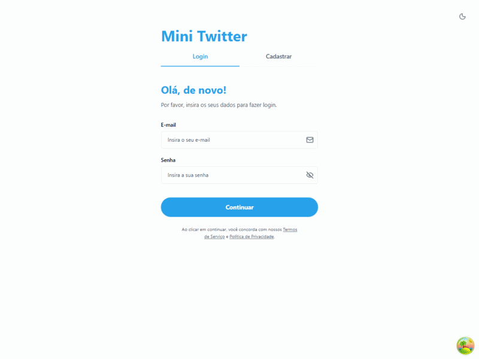
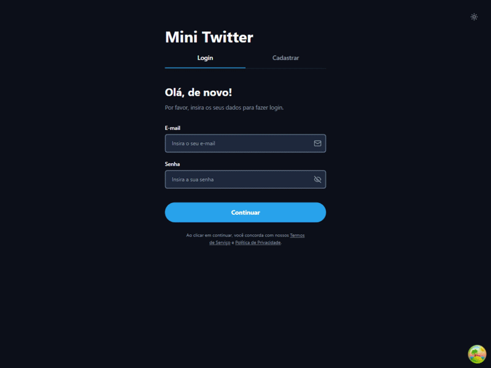

# Mini Twitter Frontend - React & TypeScript

Este é o front-end de uma mini rede social desenvolvida para o processo seletivo da B2Bit. O projeto foi construído com **React**, **TypeScript** e **Vite**, com foco em uma interface responsiva, boa experiência de usuário (UX) e código limpo.

<p align="center">
  
  
</p>

## 🚀 Tecnologias

- **Framework**: React 19, TypeScript, Vite
- **Estilização**: Tailwind CSS v4
- **Gerenciamento de Estado**: Zustand
- **Cache e Requisições**: React Query (TanStack Query), Axios
- **Formulários**: React Hook Form, Zod
- **Testes**: Vitest, React Testing Library, jsdom

## 🛠️ Funcionalidades e Pontos Importantes

- **Autenticação**: Fluxo de Login e Registro de usuários com gerenciamento de acesso.
- **Posts**: Criação, listagem, alteração e exclusão de publicações. Apenas o próprio autor tem a permissão de alterar/excluir seus posts, com controle visual inteligente que adapta as opções da interface para cada usuário.
- **Contorno de Limitação do Backend (Like Status)**: Devido o backend original não retornar via API o relacionamento permanente entre *quem* deu "like" e o post alvo, foi aplicado um modelo *Mock* de curadoria com persistência resiliente. O React interage com os metadados do `localStorage` para manter o botão e a animação de coração preenchido fidedignos para o usuário atual.
- **Consumo da API Pública (Dog CEO)**: Funcionalidade extra para geração de imagens aleatórias de cachorros no momento de criar novos posts, com visualização em tempo real nativa via URL.
- **Aprimorações Visuais e de Usabilidade**:
  - Troca de tema inteligente (Light / Dark Mode).
  - Implementação de modais de confirmação para melhorar a experiência de navegação do usuário.
  - Limpeza de dados automática no modo de Cancelamento do post.

## 🧪 Testes Automatizados

Houve a inclusão estratégica de testes baseados no padrão de projeto de **Colocation** (onde o arquivo local de teste habita próximo à sua contraparte original).
Através do **Vitest** e do **React Testing Library**, a suíte unitária focou-se no componente de fundação `<Button />`, validando e monitorando regresso de: estilo, renderização estática, interceptação de eventos de clique e estados restritivos/ausentes.

Para averiguar/rodar essa suíte de testes pontualmente no seu terminal:
```bash
npm run test
```

## 💻 Conexão e Como Rodar Localmente

Certifique-se de que a API [mini-twitter-backend-main](http://localhost:3000) já esteja ativa localmente (conforme as instruções do repositório backend que define a conexão na porta **3000**). O frontend comunicará com este serviço pela API Root URL ``http://localhost:3000``.

Siga os passos a seguir iniciar a aplicação localmente:

```bash
# 1. Verifique se o Node.js está instalado (versão 20.0 ou superior recomendada):
node -v

# 2. Instale as dependências
npm install

# 3. Inicie o servidor de desenvolvimento
npm run dev
```

A aplicação estará disponível em seu navegador pelo endereço local de conveniência do framework Vite:
**[http://localhost:5173](http://localhost:5173)**

---
Desenvolvido por **@FelipeFMedeiros** para o processo seletivo da B2Bit.
